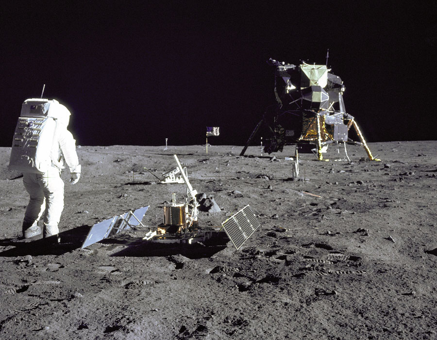

# Moonquakes

**Explanation:**  Why are there so many moonquakes? A recent reanalysis of [seismometers](http://en.wikipedia.org/wiki/Seismometer) left on the moon by the [Apollo](http://history.nasa.gov/ap11ann/introduction.htm) moon [landings](http://www.youtube.com/watch?v=RMINSD7MmT4) has revealed a surprising number of moonquakes occurring within 30 kilometers of the surface. In fact, 28 [moonquakes](http://adsabs.harvard.edu/abs/2005AGUFM.P51A0915N) were detected in data recorded between 1972 and 1977. [These moonquakes](http://science.nasa.gov/headlines/y2006/15mar_moonquakes.htm) were not only strong enough to move [furniture](http://www.maltwood.uvic.ca/hoft/timeline.html) but the stiff rock of the moon continued vibrating for many minutes, significantly longer than the soft rock [earthquakes](http://projects.crustal.ucsb.edu/understanding/elastic/rebound.html) on [Earth](http://antwrp.gsfc.nasa.gov/apod/image/0208/earthlights02_dmsp_big.jpg). The cause of the [moonquakes](http://adsabs.harvard.edu/abs/2006epsc.conf..301F) remains unknown, with one hypothesis holding that [landslides](http://earthquake.usgs.gov/learning/glossary.php?termID=105&alpha=L) in craters cause the vibrations. Regardless of the source, [future moon buildings](http://spaceflight.nasa.gov/gallery/images/vision/lunar/ndxpage1.html) need to be built to withstand the frequent shakings. [Pictured above](http://grin.hq.nasa.gov/ABSTRACTS/GPN-2000-001102.html) in 1969, Apollo 11 astronaut [Buzz Aldrin](http://en.wikipedia.org/wiki/Buzz_Aldrin) stands beside a recently deployed [lunar seismometer](http://www.lpi.usra.edu/lunar/missions/apollo/apollo_15/experiments/ps/), looking back toward the [lunar landing module](https://apod.nasa.gov/apod/ap030920.html).

