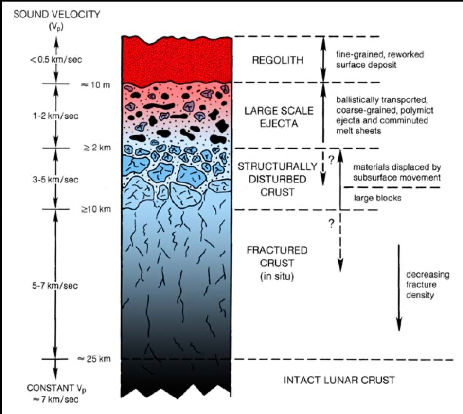
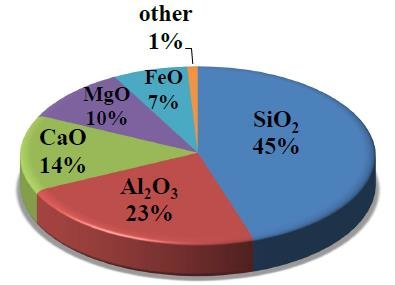

# Regolith

## Overview

- Regolith covers almost the entire surface of the Moon
- The lunar "soil" is the finer fraction of the regolith and has almost entirely been the result of billions of years of meteor and micro-meteoroid impacts on the surface.
- These impacts disintegrate basaltic and anorthositic rock, which is progressively ground finer and finer over time by successive impacts
- Solar and galactic charged particles also does some breaking down as well.
- Average depth of regolith:
   - generally 4-5 meters thick in the mare areas
   - generally 10-15 meters thick in the older high land regions
- Below the regolith: blocky bedrock, fractured over time by larger meteor impacts

## Gradations of Regolith

- Very roughly speaking, there are a few grades of regolith
- lunar dust: less than 30 micrometers in diameter
- lunar soil: 1 centimeter in diameter or less
- lunar regolith: everything else

## Composition of Lunar Regolith

## Formation Processes

- **Comminution**: mechanical breakdown of rocks and minerals into smaller particles by meteor and micrometeorite impacts.
- **Agglutination**: welding of mineral and rock fragments together by micrometeorite impact produced glass
- **Solar wind sputtering and cosmic ray spallation**: caused by impact of ions and other high energy particles
- **Fire fountaining**: older process whereby volcanic lava is spewed and cool into small glass beads before falling back to the surfac
   - orange dirt at Shorty Crater found by Apollo 17
   - green glass at Hadley-Apennine found by Apollo 15
   - Deposits of volcanic beads also though to be the orgin of dark mantle deposits (DMD) at other locations

## NASA PDF on Regolith, CMeyer 2003

[regolith.pdf](Regolith.assets/regolith.pdf)

