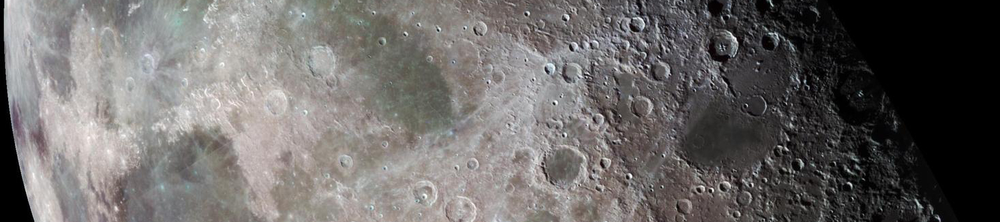

# commonplace.7robots.org
An online commonplace book created and maintained by:
[ Jefferson Burson](https://www.7robots.org).

## Table of Contents

{: .hypomnemata-title }
> hypomnemata 
>
> [interesting book quotes](hypomnemata/hypomnemata-home)

{: .selene-title }
> selene 
>
> [lunar science](selene/selene-home)

{: .polis-title }
> polis 
>
> [about Harvard, MA](polis/polis-home)

{: .agora-title }
> agora 
>
> [past conferences I’ve attended](agora/agora-home)

{: .techne-title }
> techne 
>
> [assorted geekery](techne/techne-home)

{: .anthologia-title }
> anthologia 
>
> [interesting articles](anthologia/anthologia-home)

{: .melete-title }
> melete 
>
> [mindfulness and meditation](melete/melete-home)

## What is a commonplace book?
- [Commonplace Books: Networked Knowledge and Combinatorial Creativity](https://fs.blog/networked-knowledge-and-combinatorial-creativity/)
- [How to start a commonplace book](https://imperfectjournaling.com/commonplace-book/)

